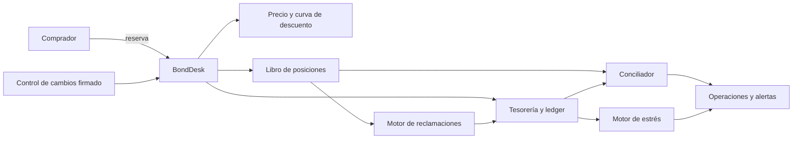
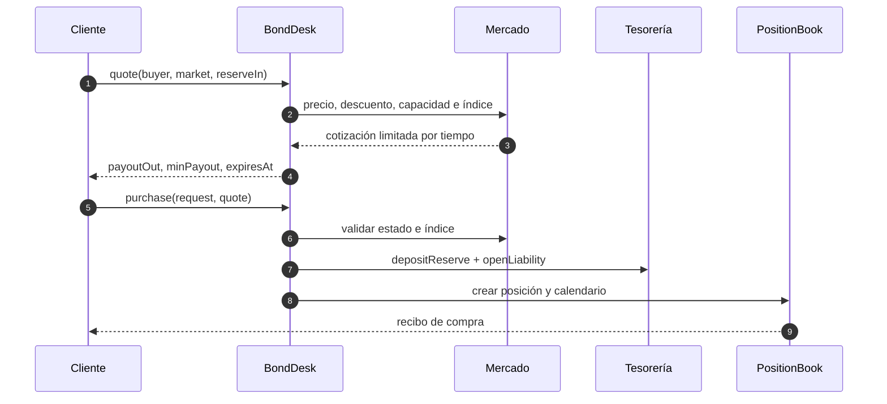
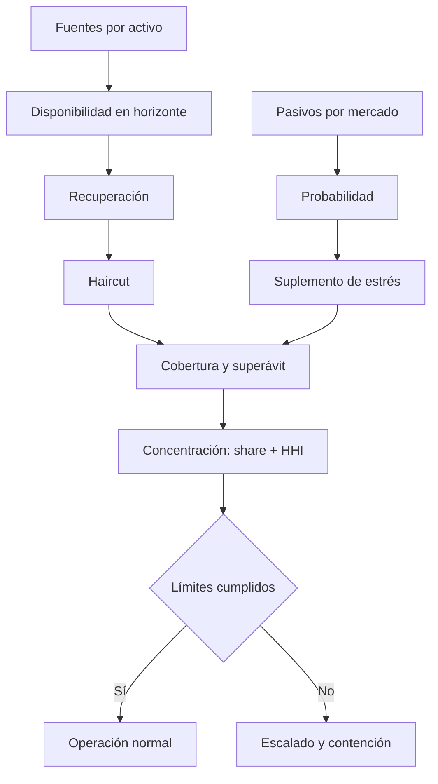
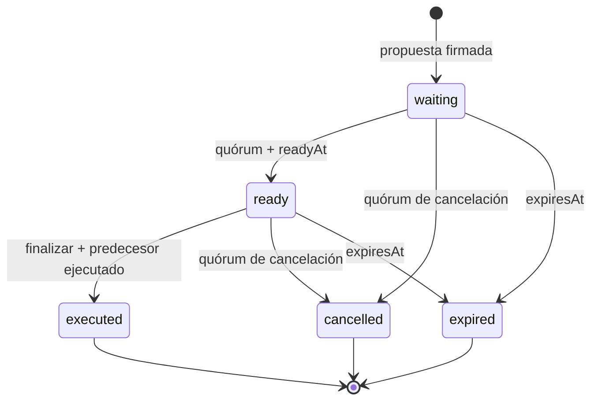

# BorealisBondProtocol


[](https://github.com/SolguardLabs/BorealisBondProtocol/actions/workflows/ci.yml)
[](https://github.com/SolguardLabs/BorealisBondProtocol/actions/workflows/release-integrity.yml)
[](https://github.com/SolguardLabs/BorealisBondProtocol/releases/tag/v1.0.0)

BorealisBondProtocol es una infraestructura de emisión de bonos con descuento para tesorerías
digitales. El motor coordina mercados de reserva, cotizaciones con caducidad, posiciones con
vesting, reclamaciones parciales, cancelaciones, conciliación contable y vigilancia de solvencia.
La versión **Production 1.0.0** incorpora evaluación de liquidez bajo estrés, control de cambios
firmado con Ed25519 y un SDK TypeScript con validación estricta de respuestas.

## Arquitectura

El protocolo separa dominio, precio, ejecución, contabilidad y supervisión. Todas las cantidades
monetarias se representan como `bigint`; la conversión decimal ocurre antes de aplicar precio y
descuento. El libro de posiciones es la fuente operativa y la tesorería mantiene el espejo de
reservas, pasivos y pagos.



Una compra solo se confirma si el mercado está activo, la cuenta tiene el rol requerido, la
cotización no ha caducado, el índice de precio coincide y las capacidades de reserva y pago siguen
dentro de política. La apertura es atómica: ingreso de reserva, alta de posición, registro de pasivo
y consumo de capacidad quedan reflejados en una misma transición.



## Modelo económico

Para una entrada de reserva `R`, normalizada a los decimales del activo de pago, un precio base
`P` expresado en WAD y un descuento final `d` en puntos básicos:

```text
u       = min(10_000, (soldReserve + R) * 10_000 / capacityReserve)
adj(u)  = u > 8_000 ? (u - 8_000) / 5 : 0
d       = min(maxDiscount, max(0, bandDiscount - adj(u)))
P_disc  = P * (10_000 - d) / 10_000
payout  = normalize(R) * 10^18 / P_disc
```

El descuento por volumen se comprime a partir del 80 % de utilización. La cotización incluye
`minPayout`, `expiresAt` y el índice vigente para limitar deslizamiento y evitar ejecuciones sobre
un estado de mercado anterior. El vesting lineal calcula:

```text
vested(t)  = payoutTotal * clamp(t - startsAt, 0, duration) / duration
claimable  = max(vested(t) - claimed, 0)
```

Las reglas completas, unidades y ejemplos numéricos están en
[docs/bond-economics.md](./docs/bond-economics.md).

## Riesgo de liquidez

El motor `BondStressEngine` ordena las entradas por identificador, limita cada supuesto a su
dominio y produce un resumen canónico SHA-256. Una fuente solo aporta liquidez si está disponible
en el horizonte; primero se aplica recuperación y después haircut. Los pasivos se ponderan por
probabilidad y reciben un suplemento de estrés.



```text
effective_i = amount_i * recoveryBps_i / 10_000 * (10_000 - haircutBps_i) / 10_000
stressed_j  = amount_j * (probabilityBps_j + stressBps_j) / 10_000
coverage    = sum(effective_i) * 10_000 / sum(stressed_j)
HHI         = sum(marketShare_k^2 / 10_000)
```

El dictamen exige simultáneamente cobertura mínima, déficit máximo, participación máxima por
mercado y HHI dentro de límite. Véase [docs/risk-model.md](./docs/risk-model.md).

## Gobierno de cambios

Los cambios sensibles llevan dominio criptográfico, digest de parámetros, nonce por proponente,
ventana temporal, quórum ponderado y, opcionalmente, un predecesor. Las firmas de propuesta y de
voto usan cargas diferentes para impedir que una autorización se reutilice con otra finalidad.



Los detalles de separación de funciones y ceremonia operativa se describen en
[docs/change-control.md](./docs/change-control.md).

## Controles principales

- Validación de roles, cuentas bloqueadas, activos y configuración de mercado.
- Aritmética entera con redondeos explícitos y normalización de 0 a 36 decimales.
- Cotizaciones ligadas a comprador, mercado, importe, caducidad e índice de precio.
- Capacidades independientes para reserva y activo de pago.
- Pasivos por posición y conciliación por posición, activo y mercado.
- Idempotencia, timeout, codificación de ruta y validación de esquema en el SDK.
- CI reproducible con dependencias fijadas y comprobación de integridad del release.

## Inicio rápido

Requisitos: Node.js 24 o superior y Bun 1.3.14 o superior.

```bash
bun install --frozen-lockfile
bun run build
bun test
bun run verify:repo
```

Ejemplo de cálculo sin conexión desde el SDK:

```ts
import { atomic, quotePayout, vestingPreview } from "./sdk/BorealisClient.js";

const payout = quotePayout(
    atomic(1_000_000_000n),
    6,
    18,
    atomic(1_000_000_000_000_000_000n),
    atomic(300n),
);
const preview = vestingPreview(payout, atomic(0n), 1_700_000_000n, 1_700_604_800n, 1_700_302_400n);
```

La integración HTTP, las claves de idempotencia y la gestión de errores se documentan en
[docs/sdk.md](./docs/sdk.md).

## Estructura

```text
src/
  accounting/     ledger, reservas, pasivos y pagos
  domain/         cuentas, activos, mercados, posiciones y vesting
  governance/     propuestas y votos Ed25519 con quórum ponderado
  lens/           vistas operativas
  operations/     conciliación por posición, activo y mercado
  pricing/        cotización, índice y curva de descuento
  risk/           monitor de capacidad y motor de estrés
  services/       compra, reclamación, cancelación y fachada
  shared/         cantidades, tiempo, eventos, ids y serialización canónica
sdk/              cliente TypeScript y cálculos sin conexión
tests/            pruebas de dominio, controles y contrato del repositorio
docs/             arquitectura, economía, riesgo, operación y SDK
```

## Documentación

| Documento                                      | Contenido                                              |
| ---------------------------------------------- | ------------------------------------------------------ |
| [Arquitectura](./docs/architecture.md)         | Fronteras, componentes, dependencias y consistencia    |
| [Economía del bono](./docs/bond-economics.md)  | Precio, descuento, vesting, cancelación y unidades     |
| [Control de cambios](./docs/change-control.md) | Firmas, quórums, timelock, nonces y predecesores       |
| [Operaciones](./docs/operations.md)            | Telemetría, conciliación y cadencia operativa          |
| [Modelo de riesgo](./docs/risk-model.md)       | Estrés de liquidez, cobertura, concentración y límites |
| [Runbooks](./docs/runbooks.md)                 | Respuesta ante alertas y recuperación controlada       |
| [SDK](./docs/sdk.md)                           | Cliente HTTP, validaciones, idempotencia y ejemplos    |

## Seguridad y releases

La política de divulgación responsable está en [SECURITY.md](./SECURITY.md). `v1.0.0` se publica
desde la rama `production`; la etiqueta anotada, la rama y el contenido ejecutado deben resolver al
mismo commit. `release-integrity.yml` vuelve a ejecutar el control de calidad sobre esa referencia
inmutable.

## Licencia

MIT. Consulte [LICENSE](./LICENSE).
