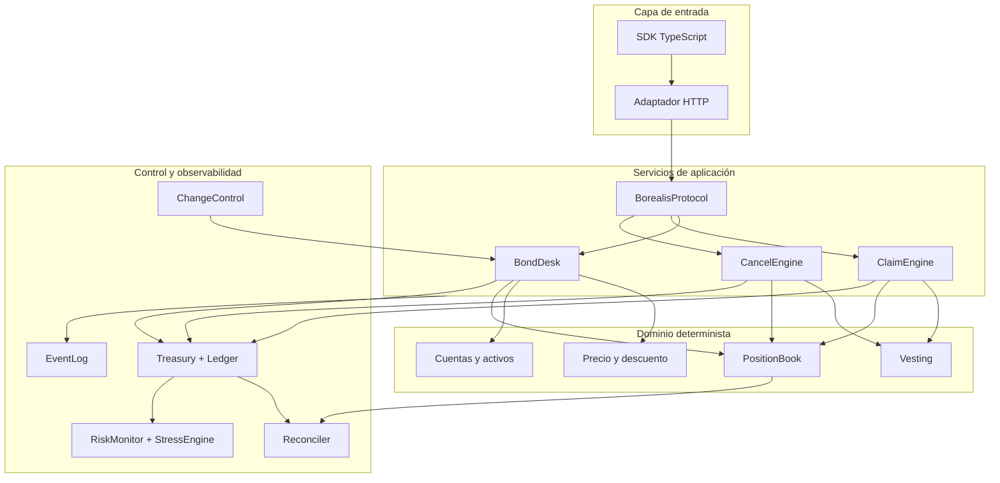
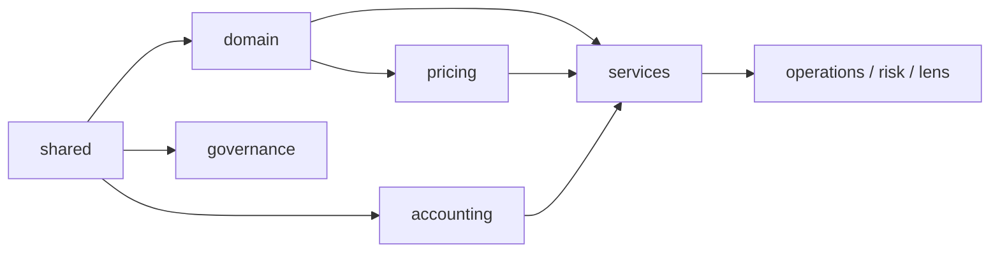

# Arquitectura del protocolo

## Objetivo y fronteras

BorealisBondProtocol administra la venta de activos de pago con descuento a cambio de activos de
reserva. El sistema convierte una intención de compra en una posición con calendario, pasivo
contable y eventos trazables. La arquitectura separa el cálculo puro de las mutaciones de estado:
precio y vesting pueden reproducirse con entradas explícitas, mientras los servicios coordinan
cuentas, tesorería y libro de posiciones.

## Capas y responsabilidades

### Dominio

`src/domain` contiene tipos inmutables para cuentas, activos, mercados, posiciones y calendarios.
Las funciones `cloneMarket` y `clonePosition` construyen la siguiente versión sin exponer una
referencia mutable. `src/shared` concentra unidades monetarias, tiempo, identificadores, errores y
serialización canónica.

### Precio y mercado

`src/pricing` selecciona la banda de descuento, calcula utilización, comprime incentivos cerca de
la capacidad y normaliza decimales. Una cotización captura el `priceIndex`; cualquier actualización
posterior invalida esa cotización. La caducidad limita el intervalo entre lectura y ejecución.

### Servicios y persistencia en memoria

`BondDesk` abre mercados, emite cotizaciones y coordina compras. `ClaimEngine` calcula el importe
disponible y solicita el pago. `CancelEngine` determina la parte no consolidada, penalización y
reembolso. `PositionBook` aplica unicidad de identificadores y ofrece vistas ordenadas. La fachada
`BorealisProtocol` agrupa estas capacidades sin ocultar sus dependencias.

### Contabilidad

`Treasury` es la puerta de entrada para reserva, emisión, pasivos y saldos de usuarios. Cada
movimiento genera asientos de doble partida en `Ledger`; el total de débitos debe coincidir con el
total de créditos. Un pasivo se abre con la posición y se reduce conforme se autorizan pagos o una
cancelación cierra la obligación restante.

### Control

`RiskMonitor` observa capacidad y cobertura inmediata. `BondStressEngine` proyecta fuentes y
salidas en un horizonte, calcula concentración y firma lógicamente el informe mediante SHA-256.
`Reconciler` compara libro y tesorería en tres niveles. `ChangeControl` autoriza modificaciones
sensibles con firmas Ed25519, quórum ponderado y espera temporal.

## Modelo de consistencia

Las operaciones siguen este orden:

1. Validar identidad, rol, estado, importe y vigencia.
2. Calcular la siguiente transición sin modificar la entrada.
3. Registrar el movimiento contable.
4. Persistir posición o mercado.
5. Emitir un evento con identificadores y cantidades atómicas.
6. Exponer una respuesta inmutable.

Los consumidores deben tratar una excepción `ProtocolError` como una transición no confirmada.
La capa HTTP debe convertirla en un error estructurado y no repetir una operación monetaria sin la
misma clave de idempotencia.

## Dependencias permitidas

El dominio no depende de servicios ni de transporte. El SDK tampoco importa estado interno: usa
tipos de red y reproduce solo fórmulas públicas. Esta dirección evita ciclos y permite verificar
economía, gobierno e integración por separado.

## Extensión segura

Una nueva clase de mercado debe declarar decimales, capacidades, bandas, ventana temporal y
calendario. Una nueva acción administrativa debe recibir un identificador estable y pasar por
`ChangeControl`. Una nueva fuente de liquidez debe indicar activo, disponibilidad, recuperación y
haircut. Toda ampliación debe incorporar pruebas de límite, rechazo, determinismo y conciliación.

## Reproducibilidad

El entorno se fija con Node.js 24, Bun 1.3.14, `package.json` y `bun.lock`. `bun run ci` verifica
formato, tipos, pruebas y contrato documental. La entrega etiquetada vuelve a ejecutar la misma
puerta de calidad y comprueba que la etiqueta anotada coincide con la rama `production`.
