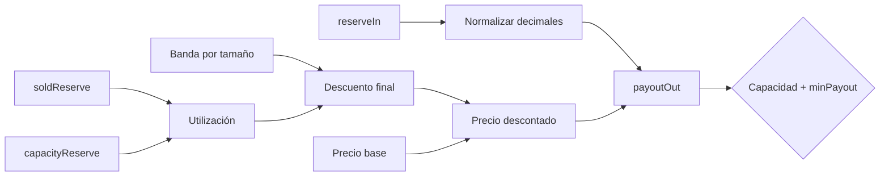

# Economía del bono

## Unidades

Todos los importes son enteros en unidades atómicas. `WAD = 10^18` representa precios y
`BPS = 10_000` representa porcentajes. Los activos pueden usar entre 0 y 36 decimales. Antes de
calcular un pago, la reserva se convierte a los decimales del activo entregado:

```text
reserveNormalized = reserveIn * 10^(payoutDecimals - reserveDecimals)   si payout >= reserve
reserveNormalized = floor(reserveIn / 10^(reserveDecimals - payoutDecimals)) en otro caso
```

El redondeo hacia abajo limita el resultado al representar una cantidad en una unidad menos
precisa. Los precios e índices deben ser estrictamente positivos.

## Curva de descuento

Cada mercado define bandas ordenadas por `minReserveIn`. La primera comienza en cero. Una compra
selecciona la última banda cuyo umbral no supera la entrada. A continuación se calcula la
utilización posterior a la operación:

```text
u = min(10_000, (soldReserve + reserveIn) * 10_000 / capacityReserve)
```

Hasta `u = 8_000`, la banda conserva su descuento. Por encima, el incentivo se comprime:

```text
utilizationAdjustment = (u - 8_000) / 5
finalDiscount = min(maxDiscount, max(0, bandDiscount - utilizationAdjustment))
```

Esta forma evita que una compra cercana al agotamiento reciba el mismo incentivo que una compra
realizada con capacidad abundante. `capacityReserve`, `capacityPayout`, `minPurchase`,
`maxPurchase` y `maxDiscountBps` actúan como restricciones independientes.

## Precio y salida

Con precio base `P` en WAD y descuento `d`:

```text
discountedPrice = floor(P * (10_000 - d) / 10_000)
payoutOut       = floor(reserveNormalized * WAD / discountedPrice)
```

Ejemplo: 1.000 USDC con 6 decimales equivalen a `1_000_000_000`. Si el activo de pago tiene 18
decimales, `P = 1 WAD` y `d = 300` BPS:

```text
reserveNormalized = 1_000_000_000_000_000_000_000
discountedPrice   = 970_000_000_000_000_000
payoutOut         = 1_030_927_835_051_546_391_752
```

El cliente puede fijar `minPayout`; una salida menor cancela la operación. La cotización también
queda vinculada a comprador, mercado, `reserveIn`, `expiresAt` y `priceIndex`.



## Vesting

Una posición conserva el importe acordado, instante de apertura, precio de compra, índice de compra
y calendario. Para vesting lineal:

```text
elapsed = clamp(now - startsAt, 0, endsAt - startsAt)
vested  = floor(payoutTotal * elapsed / duration)
```

En modo `cliff-linear`, `vested = 0` antes de `cliffEndsAt`; después se usa la misma pendiente
desde el inicio. Al llegar a `endsAt`, el importe consolidado es exactamente `payoutTotal`, evitando
restos por redondeo.

Las reclamaciones parciales no alteran el calendario. El estado pasa a `claimed` cuando la
obligación se ha satisfecho y el pasivo asociado queda cerrado. Cada recibo indica pagado, restante
nominal y estado resultante.

## Cancelación

Una cancelación solo considera la parte no consolidada y no reclamada. Si `U` es el mínimo entre
ambas cantidades:

```text
beforePenalty = floor(reservePaid * U / payoutTotal)
retained      = floor(beforePenalty * cancellationPenaltyBps / 10_000)
refund        = beforePenalty - retained
```

La penalización permanece como ingreso del protocolo. La posición se marca `cancelled`, se cierra
el pasivo restante y se emite un evento con reembolso, penalización y pago renunciado.

## Capacidades y conservación

El mercado mantiene `soldReserve` y `soldPayout` acumulados. Ninguna compra puede llevarlos por
encima de sus capacidades. La tesorería abre un pasivo por el pago total de cada posición y registra
cada movimiento con doble partida. Operaciones contrasta periódicamente:

```text
openNominal(position) == openLiability(position)
sum(openNominal by asset) <= emissionBalance under policy
sum(debits(entry)) == sum(credits(entry))
```

## Sensibilidades

Una reducción de precio aumenta `payoutOut` para la misma reserva. Un descuento superior también
aumenta el pago prometido. Un horizonte de vesting más corto incrementa la salida exigible a corto
plazo. Por eso capacidad, descuento, precio y duración se evalúan conjuntamente mediante el motor
de estrés descrito en [risk-model.md](./risk-model.md).
