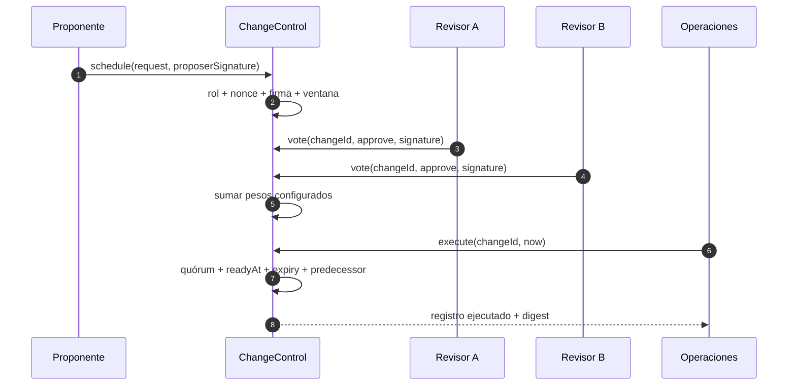
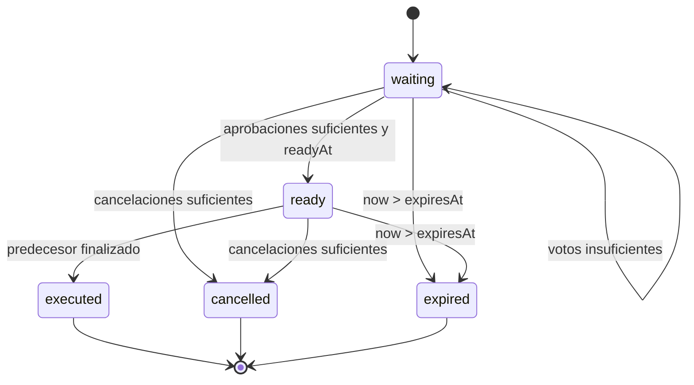

# Control de cambios

## Propósito

`ChangeControl` convierte una intención administrativa en una autorización verificable. El diseño
evita que una sola identidad modifique parámetros sensibles de inmediato. Cada solicitud incluye
objetivo, acción, digest de parámetros, proponente, nonce, tiempos y un predecesor opcional.

## Identidad criptográfica

El `Ed25519Keyring` registra una clave pública por cuenta. La firma se realiza fuera del protocolo y
se verifica sobre JSON canónico. Los enteros grandes se codifican con marca de tipo y las claves de
objetos se ordenan antes de calcular SHA-256.

La carga de propuesta usa el dominio `borealis-change-request-v1`; el digest intermedio usa
`borealis-change-digest-v1`; un voto usa `borealis-change-vote-v1`. La decisión `approve` o
`cancel` forma parte de la carga firmada. Así, una firma no es válida en otro protocolo, cambio,
revisor o decisión.

## Reglas de admisión

Una solicitud se acepta solo cuando:

- `id`, `target` y `action` cumplen el formato canónico.
- `parametersDigest` contiene 64 caracteres hexadecimales en minúscula.
- El proponente posee rol `governance` o `admin` y no está bloqueado.
- El nonce es positivo y no se usó antes para ese proponente.
- `proposedAt < readyAt < expiresAt`.
- El predecesor, si existe, es diferente de la propia solicitud.
- La firma de propuesta valida la carga completa.

Un nonce se consume al programar. Una solicitud rechazada antes de persistirse no crea un registro;
una solicitud aceptada conserva su identidad aunque después sea cancelada o expire.

## Revisores y pesos

Solo cuentas con rol `admin`, `auditor` o `governance` pueden configurarse como revisores. El peso
de cada una debe estar entre 1 y 100. Los quórums de aprobación y cancelación son independientes.
Una cuenta puede emitir como máximo un voto por decisión y cambio; el peso se toma de la
configuración vigente en el momento de registrar el voto.

Ejemplo de política:

| Rol        | Peso | Custodia recomendada |
| ---------- | ---: | -------------------- |
| Gobierno A |   40 | HSM separado         |
| Gobierno B |   35 | HSM separado         |
| Auditoría  |   25 | Clave de emergencia  |

Con quórum de aprobación 70, A+B autorizan; A+Auditoría no. Con quórum de cancelación 60,
Gobierno B+Auditoría pueden detener una solicitud sin ejecutarla.

## Estados

`ready` no ejecuta nada por sí mismo. El llamante debe finalizar la acción dentro de la ventana y
después aplicar el cambio de dominio correspondiente. Si existe predecesor, este debe estar
ejecutado. Los estados finales son inmutables.

## Procedimiento operativo

1. Serializar los parámetros definitivos y calcular su SHA-256.
2. Asignar un identificador legible y un nonce nuevo.
3. Establecer una espera proporcional al impacto y una expiración acotada.
4. Firmar la propuesta desde el dispositivo del proponente.
5. Verificar el digest por un canal independiente.
6. Recoger votos de custodias separadas.
7. Confirmar riesgo, conciliación y estado del predecesor.
8. Ejecutar dentro de ventana y archivar el informe canónico.

## Rotación y emergencia

Una clave comprometida se bloquea en el registro de cuentas y se retira del conjunto de revisores.
La sustitución se procesa como un cambio separado. Ante una acción dudosa se usa el quórum de
cancelación; no se reduce el timelock ni se reutilizan firmas. El runbook completo está en
[runbooks.md](./runbooks.md).
