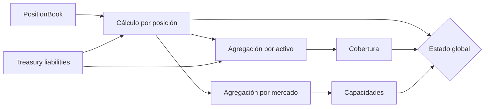

# Operaciones

## Objetivos operativos

Operaciones mantiene mercados disponibles sin perder trazabilidad contable. La prioridad es
detectar una desviación antes de que alcance el horizonte de pago, contener nuevas obligaciones y
preservar evidencia determinista. Las decisiones se basan en eventos, conciliación, cobertura,
capacidad y concentración; un indicador aislado no basta para reanudar un mercado.

## Telemetría mínima

| Señal                  | Dimensiones               | Frecuencia               | Umbral inicial                 |
| ---------------------- | ------------------------- | ------------------------ | ------------------------------ |
| Utilización de reserva | mercado, activo           | Cada bloque operativo    | watch 80 %, breach 95 %        |
| Utilización de pago    | mercado, activo           | Cada bloque operativo    | watch 80 %, breach 95 %        |
| Cobertura inmediata    | activo de pago            | Cada bloque operativo    | watch < 110 %, breach < 100 %  |
| Reclamable ahora       | activo de pago            | Cada bloque operativo    | Nunca superior a inventario    |
| Conciliación           | posición, activo, mercado | Continua + cierre diario | `matched`                      |
| Estrés de liquidez     | activo, horizonte         | Cada cambio y cada hora  | `withinLimits = true`          |
| Concentración          | mercado                   | Cada hora                | Según política aprobada        |
| Antigüedad de precio   | mercado                   | Continua                 | Menor que la ventana operativa |

Los valores en puntos básicos deben exportarse como enteros. Cada muestra incluye `asOf`, fuente,
versión y digest de estado para que una alerta pueda reproducirse.

## Cadencia

### Continua

- Verificar estado de mercado, frescura de precio y consumo de capacidades.
- Ejecutar conciliación tras compras, reclamaciones, cancelaciones y cambios de precio.
- Alertar por cualquier `deficit` o por una cobertura inferior al límite.
- Conservar eventos en orden y detectar saltos de identificador.

### Horaria

- Ejecutar escenarios base y adverso para cada activo de pago.
- Revisar mayor participación por mercado y HHI.
- Comparar vencimiento ponderado con liquidez disponible en el horizonte.
- Confirmar que no existen cambios listos sin ventana operativa asignada.

### Diaria

- Cerrar saldo de reservas, inventario, pasivos y pagos.
- Archivar el digest de conciliación y el informe de estrés.
- Revisar claves, cuentas bloqueadas y nonces administrativos.
- Comprobar que `main`, `production` y la última etiqueta publicada conservan la relación esperada.

## Conciliación

Por posición se comparan pago total, consolidado, pagado, reclamable, nominal abierto y pasivo del
libro. Una diferencia de una unidad atómica se tolera donde la división entera lo requiera; una
diferencia mayor escala a `review` o `deficit`. Por activo se compara inventario de emisión con el
reclamable inmediato y el nominal abierto. Por mercado se comprueban capacidades y agregados.

## Despliegue de una configuración

1. Preparar parámetros y digest canónico.
2. Ejecutar pruebas de tipos, límites, economía y SDK.
3. Calcular estrés con la configuración propuesta.
4. Programar el cambio firmado con nonce nuevo.
5. Reunir quórum y esperar `readyAt`.
6. Capturar conciliación previa.
7. Ejecutar y verificar eventos, estado y digest.
8. Capturar conciliación posterior.
9. Mantener observación reforzada durante una ventana completa de cotización.

## Pausa y reanudación

Una alerta de cobertura, inventario, conciliación o precio puede pausar un mercado. La pausa
impide nuevas compras, pero operaciones debe seguir midiendo obligaciones existentes. La
reanudación requiere causa identificada, estado conciliado, escenario adverso dentro de límites,
precio fresco y autorización registrada.

## Registros

Los logs no deben contener claves, cabeceras de autorización ni datos completos del cliente. Se
registran identificadores, código de resultado, cantidades atómicas necesarias, digest y marca
temporal. La retención debe cubrir el mayor periodo de vesting más la ventana de revisión interna.

Los procedimientos detallados de respuesta se encuentran en [runbooks.md](./runbooks.md).
