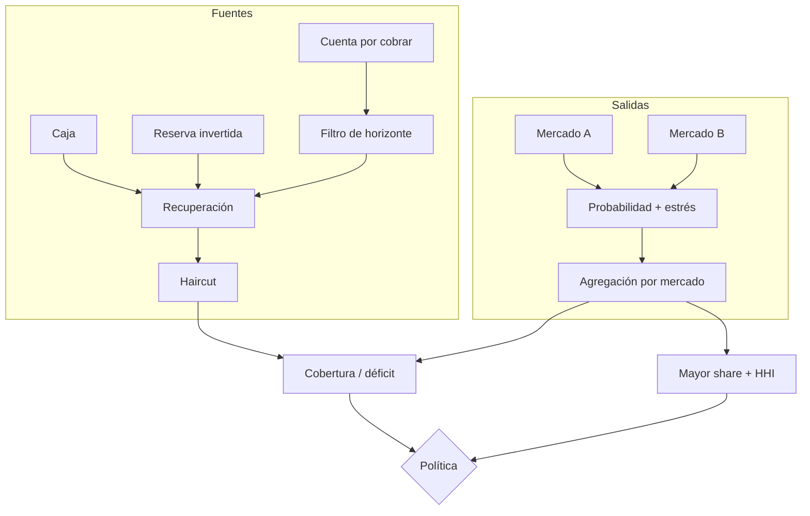

# Modelo de riesgo

## Alcance

El modelo estima si las fuentes realizables de un activo cubren sus salidas dentro de un horizonte
definido. No sustituye la conciliación: la conciliación compara obligaciones presentes, mientras el
estrés aplica disponibilidad, recuperación, haircuts, probabilidad y concentración a flujos futuros.
Ambos informes deben coincidir en activo, instante de referencia y versión de configuración.

## Entradas

Una `LiquiditySource` contiene:

- identificador canónico y activo;
- importe en unidades atómicas;
- instante a partir del cual está disponible;
- recuperación esperada en BPS;
- haircut posterior a la recuperación en BPS.

Un `LiabilityBucket` contiene identificador, mercado, activo, importe, vencimiento, probabilidad y
suplemento de estrés. Las listas deben estar ordenadas estrictamente por identificador. Esta regla
elimina variaciones de digest causadas por el orden de llegada.

## Fuentes efectivas

Para cada fuente `i` y final de horizonte `H`:

```text
available_i = availableAt_i <= H
recovered_i = available_i ? floor(amount_i * recoveryBps_i / 10_000) : 0
haircut_i   = floor(recovered_i * haircutBps_i / 10_000)
effective_i = recovered_i - haircut_i
```

La secuencia importa: el haircut se aplica al valor recuperado, no al nominal inicial. Una fuente
fuera del horizonte aporta cero aunque su calidad sea alta.

## Salidas bajo estrés

Para cada pasivo `j`:

```text
due_j       = dueAt_j <= H
probable_j  = due_j ? floor(amount_j * probabilityBps_j / 10_000) : 0
stress_j    = due_j ? floor(amount_j * stressBps_j / 10_000) : 0
stressed_j  = probable_j + stress_j
maturity_j  = max(0, dueAt_j - asOf)
```

El suplemento se calcula sobre el nominal y se suma a la salida probable. `probabilityBps` y
`stressBps` están acotados individualmente a 10.000.

## Solvencia temporal

```text
S = sum(effective_i)
L = sum(stressed_j)
surplus   = max(S - L, 0)
shortfall = max(L - S, 0)
coverageBps = L == 0 ? 20_000 : floor(S * 10_000 / L)
weightedMaturity = L == 0 ? 0 : floor(sum(stressed_j * maturity_j) / L)
```

El valor 20.000 BPS cuando no hay salida evita una división por cero y expresa cobertura holgada,
no una cantidad ilimitada.

## Concentración

Las salidas se agregan por mercado `k`:

```text
share_k = L == 0 ? 0 : floor(outflow_k * 10_000 / L)
HHI_k   = floor(share_k^2 / 10_000)
HHI     = sum(HHI_k)
```

El HHI se expresa en la misma escala BPS. Un único mercado produce aproximadamente 10.000; dos
mercados de igual tamaño producen aproximadamente 5.000. Por redondeo, la suma de participaciones
puede diferir de 10.000 en pocas unidades.



## Ejemplo

Con caja de 800.000 plenamente disponible y una reserva de 400.000 con recuperación del 90 % y
haircut del 10 %, la fuente efectiva es `800.000 + 324.000 = 1.124.000`. Una cuenta por cobrar que
vence después del horizonte aporta cero.

Si un mercado exige 300.000 sin suplemento y otro 600.000 con 100 % de probabilidad más 20 % de
estrés, la salida total es `300.000 + 720.000 = 1.020.000`. El resultado es:

```text
surplus     = 104.000
coverageBps = floor(1.124.000 * 10.000 / 1.020.000) = 11.019
shares      = 2.941 BPS y 7.058 BPS
HHI         = 5.845 BPS
```

## Dictamen

`withinLimits` solo es verdadero cuando se cumplen las cuatro condiciones:

```text
shortfall <= maxShortfall
coverageBps >= minCoverageBps
largestMarketShareBps <= maxMarketShareBps
marketHhiBps <= maxMarketHhiBps
```

El digest incluye dominio, activo, horizonte, fuentes efectivas, salidas, cobertura, déficit, HHI y
dictamen. Operaciones debe archivar entradas y digest; un digest aislado no permite reconstruir los
supuestos.

## Escenarios recomendados

- Base: recuperación contractual y probabilidades observadas.
- Adverso: haircuts reforzados, adelanto de vencimientos y mayor suplemento.
- Concentración: indisponibilidad de la mayor fuente y salida completa del mayor mercado.
- Liquidez tardía: excluir toda fuente disponible después del vencimiento ponderado.

Un cambio de capacidad, descuento, precio, calendario o fuente requiere recalcular los cuatro.
