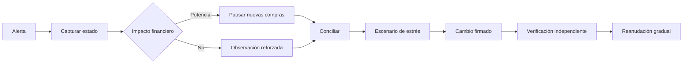

# Runbooks operativos

## Reglas generales

Toda respuesta comienza conservando el estado: instante, commit, versión, mercado, activo, eventos
recientes y digests. Una pausa puede aplicarse de forma preventiva; una corrección monetaria no se
ejecuta manualmente. Las modificaciones usan el control de cambios firmado y dejan conciliación
antes y después.

## Cobertura por debajo de política

**Disparador:** `TREASURY_COVERAGE` en `watch` o `breach`, o `claimableNow > emissionBalance`.

1. Pausar nuevas compras del activo y conservar reclamaciones ya autorizadas según política.
2. Capturar `emissionBalance`, nominal abierto, reclamable, pasivos y precio por mercado.
3. Ejecutar conciliación por posición; separar diferencias contables de falta de liquidez.
4. Ejecutar escenarios base, adverso y pérdida de la mayor fuente.
5. Confirmar que no hay un cambio administrativo pendiente sobre el mismo activo.
6. Preparar medidas: aumentar inventario, reducir capacidad, ajustar descuento o ampliar horizonte.
7. Autorizar la medida con quórum y espera correspondiente.
8. Reanudar solo con conciliación `matched` y todos los límites de estrés cumplidos.

## Diferencia de conciliación

**Disparador:** estado global `review` o `deficit`.

1. Detener operaciones que creen nuevas obligaciones en los mercados afectados.
2. Identificar el primer evento tras el último digest coincidente.
3. Reproducir compras, pagos y cancelaciones en orden temporal.
4. Comparar `openNominal` y `liabilityBook` por posición.
5. Agregar por activo y mercado para determinar propagación.
6. Verificar direcciones de redondeo y decimales de los activos.
7. No compensar diferencias entre posiciones distintas.
8. Preparar una corrección determinista, revisarla y ejecutarla mediante control de cambios.
9. Archivar informe previo, acción, informe posterior y digest.

Una unidad atómica puede ser una diferencia de redondeo aceptada por política. Cualquier valor
superior requiere explicación y aprobación.

## Precio obsoleto o salto de índice

**Disparador:** antigüedad superior a la ventana, cambio fuera de banda o rechazo repetido de
cotizaciones por índice.

1. Pausar el mercado y cancelar cotizaciones pendientes a nivel de integración.
2. Conservar observación anterior, nueva observación, fuente, instante y razón del keeper.
3. Comparar el precio con fuentes independientes aprobadas.
4. Recalcular `computePriceMove` con enteros exactos.
5. Confirmar que el nuevo índice es positivo y monótono respecto a la relación de precios.
6. Ejecutar conciliación y estrés antes de aceptar nuevas compras.
7. Reanudar con una nueva observación y vigilar una ventana de cotización completa.

No se debe prolongar la caducidad de cotizaciones antiguas.

## Capacidad elevada

**Disparador:** utilización de reserva o pago en `watch` o `breach`.

1. Revisar la compra que produjo el cruce y su banda de descuento.
2. Confirmar `soldReserve`, `soldPayout` y capacidades desde el libro.
3. Proyectar salidas al final de cada calendario vigente.
4. Reducir tamaño máximo o pausar si la cobertura adversa no cumple.
5. Un aumento de capacidad requiere fuente adicional verificable y cambio firmado.

## Cambio administrativo dudoso

**Disparador:** digest no reconocido, firma inválida, nonce repetido, dependencia incompleta o
votos inesperados.

1. No ejecutar aunque el reloj haya alcanzado `readyAt`.
2. Comparar la carga canónica con el documento aprobado.
3. Bloquear la cuenta si existe sospecha sobre su custodia.
4. Reunir el quórum de cancelación con firmas nuevas.
5. Rotar claves mediante una solicitud independiente.
6. Revisar otros cambios firmados por la misma identidad y sus nonces.

## Degradación del SDK o transporte

**Disparador:** timeouts, JSON malformado, esquema inesperado o estado `degraded`/`halted`.

1. Detener reintentos automáticos sin clave de idempotencia estable.
2. Consultar `/v1/health` y conservar `stateDigest`.
3. Separar error de transporte de rechazo de aplicación.
4. No interpretar una respuesta parcial como confirmación.
5. Reconciliar por identificador antes de reenviar una operación monetaria.

## Cierre

Un incidente se cierra cuando la causa está documentada, los activos están conciliados, el motor de
estrés cumple límites, los cambios están finalizados, las pruebas reproducen el resultado esperado y
la observación posterior no muestra recurrencia. El registro final conserva responsables por rol,
no secretos ni datos personales innecesarios.
