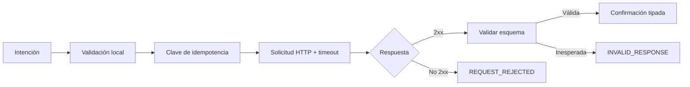

# SDK TypeScript

## Instalación y alcance

`sdk/BorealisClient.ts` ofrece un cliente sin dependencias de ejecución. Usa `fetch`,
`AbortSignal.timeout`, `URL`, SHA-256 y tipos nativos de Node.js 24. El SDK cubre salud,
cotización, compra, reclamación y cancelación, además de cálculos locales de precio y vesting.

```ts
import {
    BorealisClient,
    HttpBorealisTransport,
    atomic,
    deriveIdempotencyKey,
} from "./sdk/BorealisClient.js";

const client = new BorealisClient(
    new HttpBorealisTransport({
        baseUrl: "https://api.example.invalid/",
        apiKey: process.env.BOREALIS_API_KEY,
        timeoutMs: 8_000,
    }),
);
```

La URL solo admite HTTP o HTTPS. En una configuración operativa debe usarse HTTPS. El token se
mantiene en memoria y se envía como `Authorization: Bearer`; la aplicación no debe registrarlo.

## Cantidades atómicas

Las cantidades de red se representan como cadenas decimales no negativas, sin signo, separador ni
notación exponencial. `atomic` convierte `bigint`, entero seguro o cadena válida:

```ts
const reserveIn = atomic(1_000_000_000n);
const zero = atomic("0");
```

Los `number` fuera del rango entero seguro se rechazan. Para valores financieros se recomienda
usar siempre `bigint` o cadena.

## Salud

```ts
const health = await client.requireHealthy();
console.log(health.version, health.network, health.stateDigest);
```

`requireHealthy` solo acepta `status: "ok"`. `stateDigest` debe contener 64 caracteres
hexadecimales. Una respuesta con campos ausentes, estados desconocidos o digest incorrecto produce
`BorealisClientError`.

## Cotización y compra

```ts
const intent = {
    buyer: "account:treasury-01",
    market: "market:usdc-boreal",
    reserveIn: atomic(1_000_000_000n),
    minPayout: atomic(1_020_000_000_000_000_000_000n),
};

const quote = await client.quote(intent);
const key = deriveIdempotencyKey("purchase:2026-08-15", intent);
const receipt = await client.purchase(intent, key);
```

`purchase` obtiene una cotización nueva y envía su contenido con la clave. La clave debe tener
entre 16 y 160 caracteres y usar letras, números, dos puntos, guion o guion bajo. Para reintentar la
misma intención se reutiliza exactamente la misma clave; una intención diferente necesita otra.

## Reclamación y cancelación

```ts
const claimIntent = {
    owner: "account:treasury-01",
    position: receipt.position,
    maxAmount: atomic(250_000_000_000_000_000_000n),
};
const claimKey = deriveIdempotencyKey("claim:2026-08-15", claimIntent);
const claim = await client.claim(claimIntent, claimKey);

const cancelKey = deriveIdempotencyKey("cancel:2026-08-15", {
    owner: claimIntent.owner,
    position: receipt.position,
});
const cancellation = await client.cancel(claimIntent.owner, receipt.position, cancelKey);
```

El SDK valida identificadores antes de construir la ruta y usa `encodeURIComponent` para el
identificador de posición. Una respuesta de reclamación solo admite `vesting` o `claimed`; una
cancelación confirmada debe devolver `cancelled`.

## Cálculos locales

`quotePayout` reproduce normalización decimal, precio descontado y salida con aritmética entera:

```ts
import { quotePayout } from "./sdk/BorealisClient.js";

const payout = quotePayout(
    atomic(1_000_000_000n),
    6,
    18,
    atomic(1_000_000_000_000_000_000n),
    atomic(300n),
);
```

`vestingPreview` calcula consolidado y reclamable para un calendario lineal:

```ts
import { vestingPreview } from "./sdk/BorealisClient.js";

const state = vestingPreview(payout, atomic(0n), 1_700_000_000n, 1_700_604_800n, 1_700_302_400n);
```

El cálculo local sirve para presentar una estimación; la respuesta del protocolo es la fuente de
confirmación porque incorpora estado, capacidad e índice vigentes.

## Errores

`BorealisClientError` expone `code`, `status` opcional y `detail` opcional. Códigos relevantes:

| Código                 | Significado                         | Acción                                      |
| ---------------------- | ----------------------------------- | ------------------------------------------- |
| `INVALID_AMOUNT`       | Cantidad o representación no válida | Corregir antes de enviar                    |
| `INVALID_IDENTIFIER`   | Identificador fuera de formato      | No reintentar sin cambios                   |
| `TRANSPORT_ERROR`      | Timeout o fallo de red              | Reconciliar y reintentar con la misma clave |
| `REQUEST_REJECTED`     | HTTP no satisfactorio               | Evaluar estado y detalle                    |
| `INVALID_JSON`         | Respuesta no interpretable          | Marcar integración degradada                |
| `INVALID_RESPONSE`     | Esquema inesperado                  | No tratar como confirmación                 |
| `PROTOCOL_NOT_HEALTHY` | Estado distinto de `ok`             | Detener nuevas operaciones                  |



## Pruebas de integración

Un adaptador debe cubrir timeout, cuerpo vacío, JSON incorrecto, estado HTTP, esquema, codificación
de ruta y repetición idempotente. Los mocks deben capturar método, ruta, cuerpo y clave sin copiar
credenciales a snapshots.
